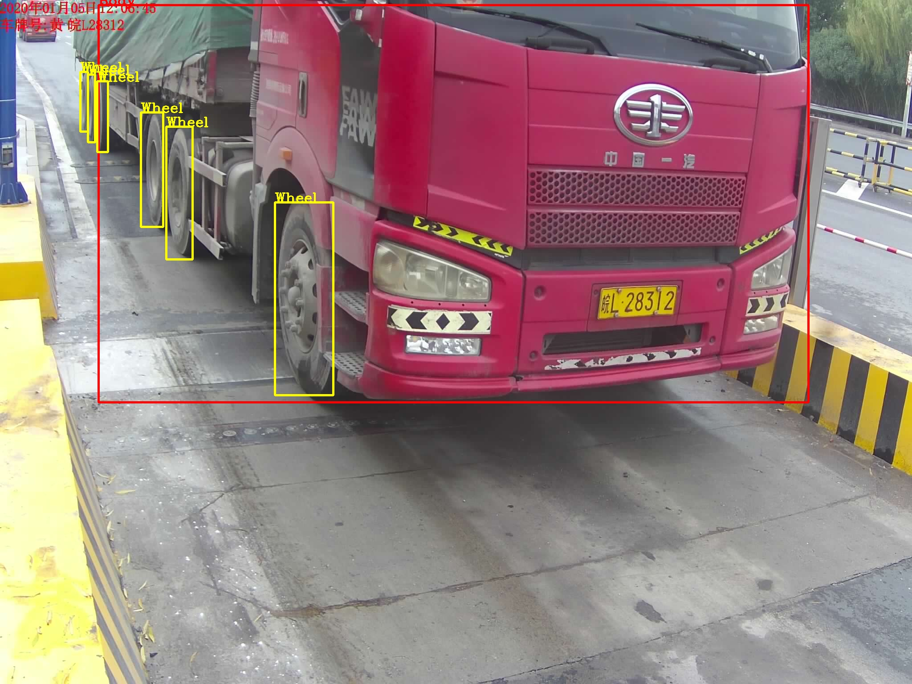
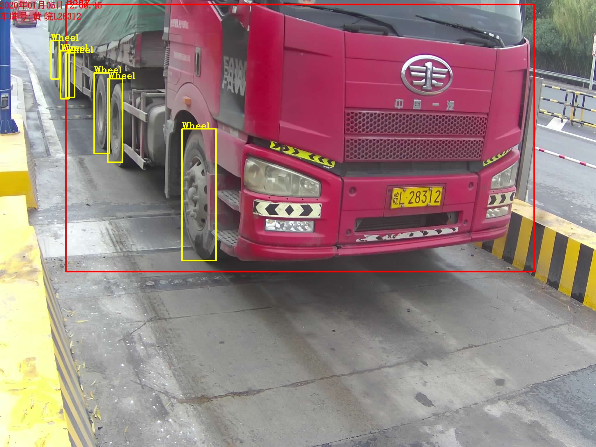

# YOLO-v3-caffe
Caffe model of YOLO v3 and model prune with Network Slimming.

With Network Slimming, I can prune 99% parameters in my dataset.

Trained orignal YOLOv3 model  and pruned model : https://pan.baidu.com/s/1T3AVe3L9MbxKCMI9F8ezVg code: 4wed

Test with：

​           Ubuntu16.04

​			caffe(add upsample layer)

​			RTX2070

change the CMakeList.txt config according to your env。

# Make

```shell
mkdir build
cd build
cmake ..
make -j8
```

# Demo

test with orignal YOLO:

```
./x86_64/bin/detectnet ../wheel/yolov3-wheel.prototxt ../wheel/yolov3-wheel.caffemodel ../images/4.jpg
```

test the pruned model:

```shell
./x86_64/bin/detectnet ../wheel/yolov3-wheel-pruned.prototxt ../wheel/yolov3-wheel-pruned.caffemodel ../images/4.jpg
```

## Compare

| Model                | mAP      | Parameters | Molde Size | GPU Mem | time  |
| -------------------- | -------- | ---------- | ---------- | ------- | ----- |
| orignal YOLOv3       | 0.899230 | 61529119   | 246.5M     | 2230MiB | 88 ms |
| 99.04% pruned YOLOv3 | 0.899493 | 589799     | 2.4M       | 1320MiB | 33 ms |

## Results

orignal YOLOv3 trained model：



pruned model test ：




